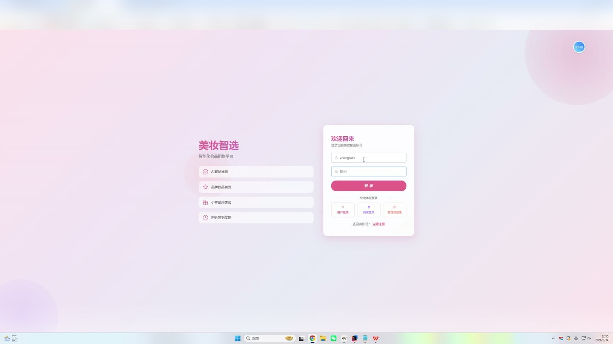
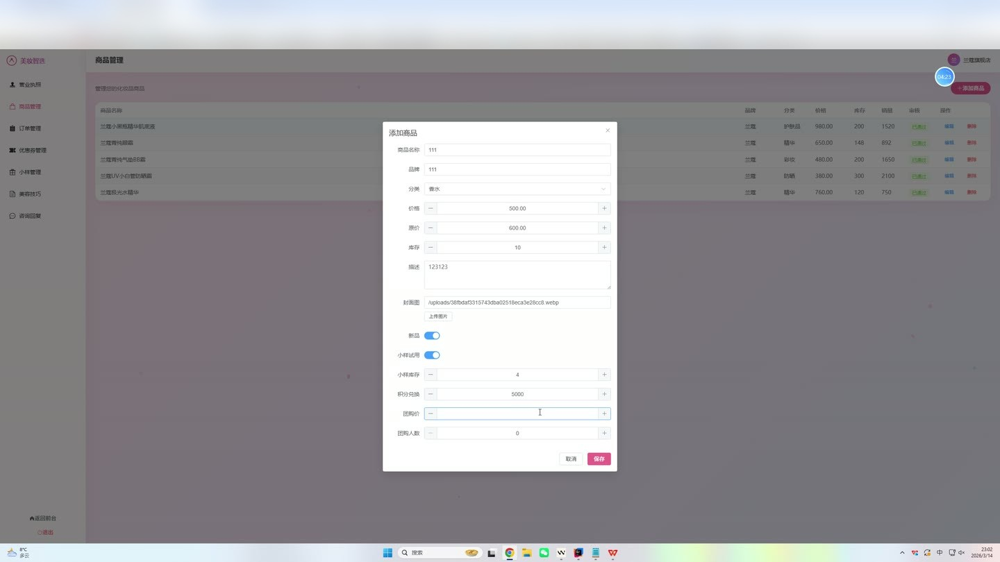
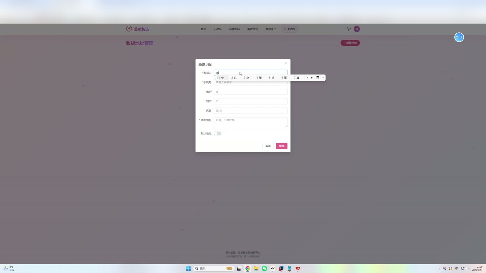
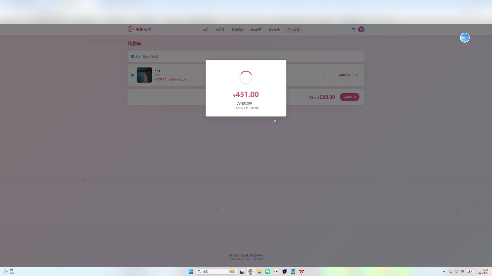

# (附文档)Springboot3+Vue3+MySQL 化妆品销售系统

**技术栈**：Springboot3、Vue3、MySQL

### 系统简介

本系统是一套基于 Spring Boot 3 + Vue 3 + MySQL 的化妆品销售平台，采用前后端分离架构，支持普通用户、商家、管理员三种角色。系统涵盖商品浏览、购物车、订单管理、积分签到、优惠券领取、社区论坛、在线客服、AI 智能美妆咨询、小样试用申请等完整电商功能，并内置商家入驻审核、商品审核、内容审核等管理流程。
 
### 核心功能
 
### 普通用户端

 
- 注册/登录：支持用户名密码注册登录，提供快速登录入口（一键切换角色） 
- 商品浏览：查看商品列表（支持分类筛选、关键词搜索、品牌筛选、新品/小样筛选、按销量/价格排序） 
- 商品详情：查看商品图文详情、原价/现价、库存、品牌、商家信息 
- 购物车管理：添加商品到购物车、修改数量、删除单项、清空购物车 
- 下单结算：从购物车或直接购买创建订单，支持填写收货地址、电话、收件人、备注 
- 订单管理：查看订单列表（按状态筛选）、支付订单（支持积分抵扣）、确认收货、取消订单 
- 收货地址管理：新增/编辑/删除地址、设置默认地址、按默认时间排序展示 
- 每日签到：每日打卡获得 10 积分，记录最后签到日期 
- 优惠券领取：查看可用优惠券列表、领取优惠券、查看我的优惠券（按使用状态筛选） 
- 社区论坛：发布帖子（含标题/内容/图片）、浏览帖子列表、查看帖子详情（浏览量+1）、点赞帖子、评论帖子 
- 美容技巧：浏览已审核通过的美容技巧文章（按类型筛选）、查看详情（浏览量+1） 
- 小样试用：申请小样试用（填写地址/电话/收件人）、查看我的申请记录 
- 在线客服：查看联系人列表、发送/接收消息、查看聊天记录（自动标记已读）、查看未读消息数量 
- AI 智能咨询：向 AI 美妆顾问提问（护肤/防晒/口红/美白/积分等），获取自动回复建议 
- 个人信息编辑：修改昵称、手机、邮箱、头像；修改登录密码（需验证原密码）
 
### 商家端

 
- 商品管理：查看自己发布的商品列表、新增商品（需先上传营业执照并通过审核）、编辑商品、删除商品 
- 商品审核状态：查看商品审核状态（待审核/通过/拒绝） 
- 订单处理：查看本店订单列表（按状态筛选）、查看订单详情（含商品明细和用户信息）、发货（填写物流单号和物流公司） 
- 优惠券管理：查看本店优惠券列表、新增优惠券（设置名称/类型/折扣/满减/总量/有效期）、编辑/删除优惠券 
- 小样申请管理：查看本店商品的小样申请列表、审核通过/拒绝申请（通过后自动扣减小样库存并生成 0 元订单）、标记发货 
- 美容技巧：发布美容技巧文章（标题/内容/封面/类型，提交后待管理员审核）、查看自己发布的文章列表 
- 营业执照上传：上传营业执照图片，提交后待管理员审核
 
### 管理员端

 
- 仪表盘：查看平台用户总数、商家总数 
- 用户管理：查看用户列表（按角色/关键词筛选）、启用/禁用用户账号、删除非管理员账号 
- 商家审核：查看商家列表（按营业执照审核状态筛选）、审核商家营业执照（通过/拒绝） 
- 商品审核：查看所有商品列表（按审核状态筛选）、审核商品（通过/拒绝） 
- 商品分类管理：查看分类列表、新增/编辑/删除分类（支持排序） 
- 订单管理：查看平台所有订单（按状态筛选）、查看订单详情（含用户和商家信息） 
- 美容技巧管理：查看所有文章（按类型/审核状态筛选）、新增/编辑文章、审核文章（通过/拒绝）、删除文章 
- 社区论坛管理：查看所有帖子列表、审核帖子（置顶/隐藏/删除）、删除帖子时同时删除其评论 
- 轮播图管理：查看轮播图列表、新增/编辑/删除轮播图（设置标题/图片/链接/排序/位置/状态） 
- 系统配置管理：查看系统配置列表、编辑配置值（键值对形式）
 
### 技术栈

 后端框架Spring Boot 3 ORMMyBatis-Plus 权限认证JWT（JJWT） 密码加密Spring Security Crypto（BCryptPasswordEncoder） 前端框架Vue 3（Vite 构建） 状态管理Pinia 路由Vue Router UI 组件库Element Plus 构建工具Vite 数据库MySQL 文件上传本地文件存储（MultipartFile）
 
### 交付内容

 
- 后端完整源码 
- 前端完整源码 
- 数据库初始化脚本 
- 万字文档

## 界面展示

---

## 获取完整源码 + 万字文档

本仓库为项目介绍页。**完整前后端源码、数据库初始化脚本、万字项目文档**，请加微信 `kangkangcode`，或访问 [codekk.top](http://codekk.top) 获取。

可作课程设计 / 毕业设计参考，支持远程部署调试。